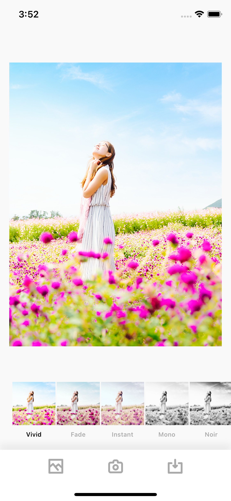
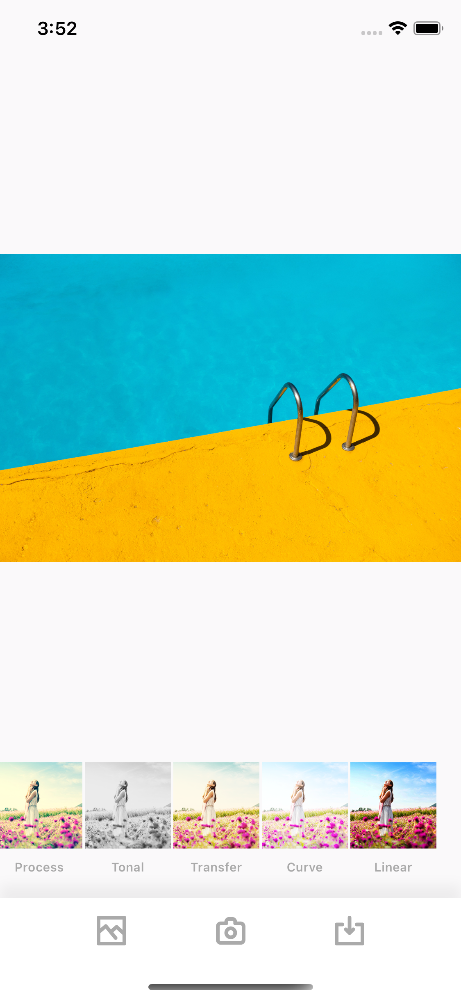

## 🖼 Summer
사진 필터 앱이며 Analog Paris 클론 앱. 여름에 맞는 사진 필터 적용 앱을 만들어 보는 것이 목표.

## 내용
- Storyboard 기반 앱 만들기
- Autolayout 의 이해
- UIImagePickerViewController 적용
- UICollectionView 적용해보기
- CoreImage 를 이용한 필터 적용
- 이미지 처리를 위한 백그라운드 프로세싱 이해와 적용

## 최종화면
 

## 더 고민해봐야 할 사항
- 필터 적용시의 성능의 저하 없이 리사이즈된 이미지가 아닌 원본 이미지에 필터를 적용해서 저장하려면 어떻게 해야 할까?

### 링크
[첫화면으로 돌아가기](https://github.com/iwill-hwang/fastcampus-ios)
